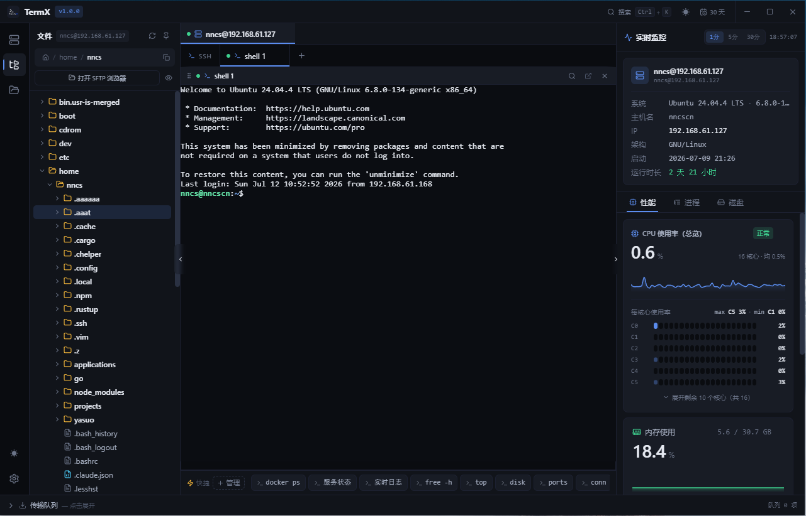
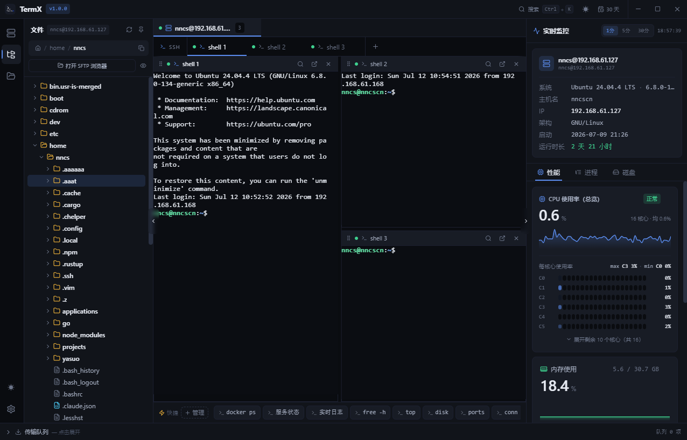
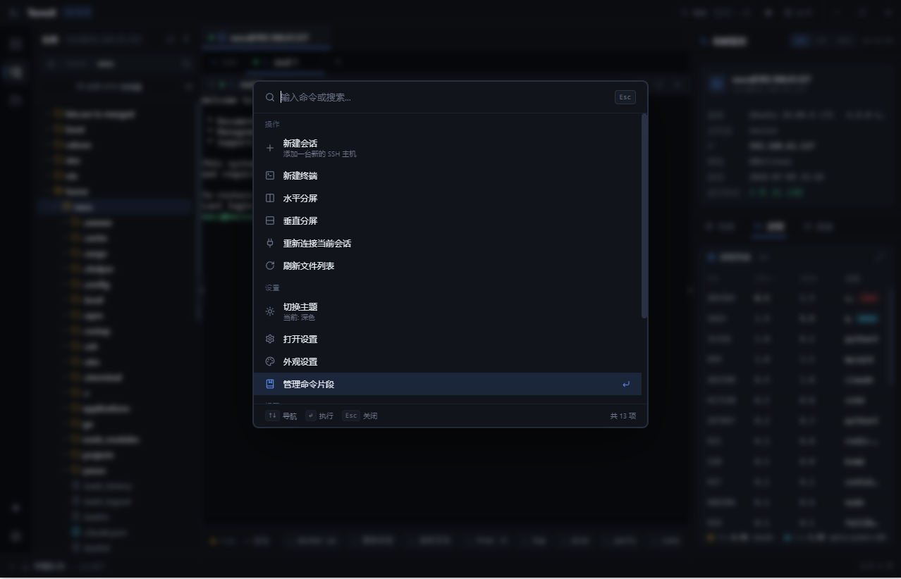
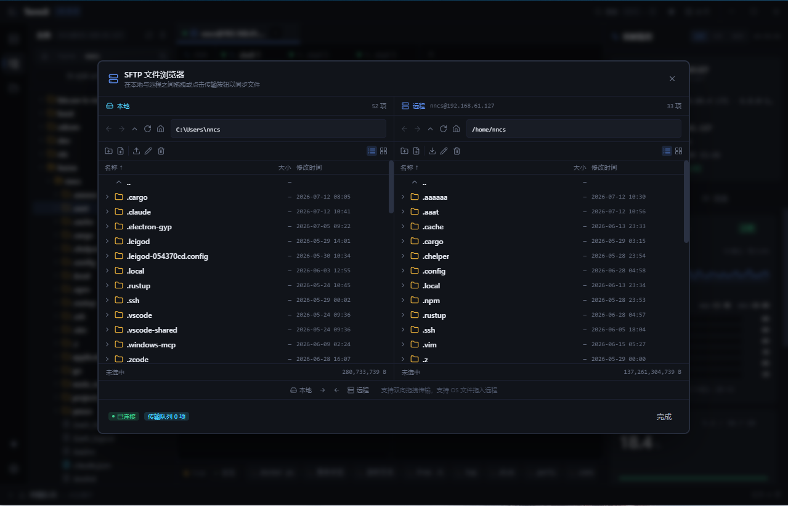
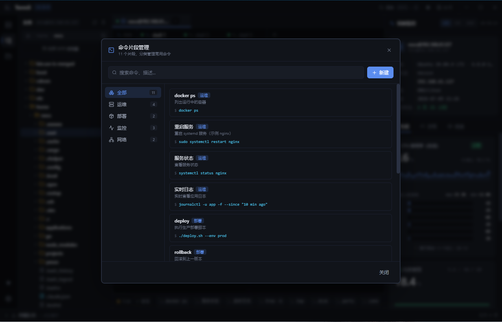
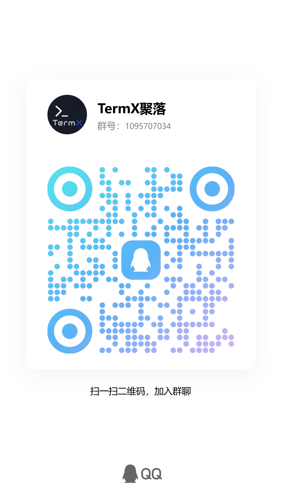

# TermX

**为现代运维而生的桌面 SSH 工作台**

终端 · 监控 · 文件 · 片段 — 同一窗口，一气呵成

[官网](https://termx.cn/) · [下载最新版](../../releases) · [个人永久免费 · 禁止商用](#授权与免费) · [QQ 群 1095707034](#社区)

---

## 为什么是 TermX

服务器日常运维的真正痛点从不是某一条命令，而是**工具切换**——终端开一个窗口、监控面板开一个、SFTP 工具开一个、命令片段记在便签里。TermX 把这些能力合并到同一个桌面应用，让一屏之内能看清楚、操作完所有事。

- **一站式工作台** — 终端、SFTP、监控、片段四模块同屏协作，告别多窗口切换
- **生产环境就绪** — 实时性能监控走 SSH 通道直采，服务端无需安装任何 Agent
- **键盘优先工作流** — 命令面板 <kbd>Ctrl</kbd>+<kbd>P</kbd> 键盘可达一切操作，手不离键盘
- **国产中文优先** — 界面、文档、社区均为中文，符合国内运维使用习惯
- **数据本地化** — 除检查更新外不联网，所有数据保存在本地
- **个人永久免费** — 核心功能无限制、无广告、无内购，个人使用零成本

---

## 核心特性

### 多窗格终端

分屏不只是分屏，是把同一个会话切成多个独立工作区。看日志的同时调试进程，跑部署的同时盯监控，对比生产与测试服的输出——所有终端共享同一窗口，分隔比例可拖拽调整，每个 shell 拥有独立历史、当前目录与命令补全。

- 多标签 + 任意水平 / 垂直分屏组合
- 全 Unicode / 中文 / 256 色终端渲染，选中即复制、右键粘贴
- 配色方案、字体、行高、光标样式、滚动回看均可自定义
- 命令历史记录与命令建议
- 文件路径、URL 自动识别可点击

### 实时性能监控

SSH 会话一旦建立，监控面板即刻开始采集系统关键指标。所有数据通过现有 SSH 通道传输，**服务端零侵入、无需安装任何 Agent**。

- **系统信息** — 操作系统、内核版本、主机名、IP、架构、启动时间、运行时长
- **CPU** — 总览使用率 + 每核心使用率（支持数十核心），1 / 5 / 30 分钟趋势曲线，最高 / 最低核心标注
- **内存** — 物理内存 + Swap 使用量与占比
- **磁盘** — 分区挂载点、容量、读写 IO 速率
- **网络** — 每网卡上下行吞吐、TCP 连接数
- **进程** — Top N 进程，按 CPU / 内存排序

### SFTP 文件浏览器

图形化的远程文件管理器，免去命令行 `cd` / `ls` / `rm` 的繁琐。从 Windows 资源管理器拖文件即上传，状态栏实时显示传输进度。

- 双栏布局：左侧远程文件树、右侧当前目录列表
- 完整操作：上传、下载、新建、删除、重命名、权限修改
- 文件属性四列详情：名称、大小、权限位、修改时间
- 拖拽上传：本地资源管理器直接拖入即开始传输
- 传输队列：底部状态栏展开查看实时进度

### 命令片段库

把复杂长命令保存成可复用片段，按业务场景分类组织，一键插入到当前终端。新人入职直接用团队积累的片段库，免去反复查文档。

- 自定义分类（运维 / 安装 / 网站 / 其他，可无限扩展）
- 每条片段含：标题、描述、命令正文、标签
- 全文搜索：标题 + 命令正文 + 标签
- 底部状态栏快捷栏一键插入当前光标位置
- 团队常用命令沉淀成知识资产

### 命令面板

按下 <kbd>Ctrl</kbd>+<kbd>P</kbd> 召唤快速命令入口。模糊搜索、键盘导航，所有操作不用鼠标点击。

- 涵盖：会话管理、终端管理、分屏、外观、设置、主题切换、重连、SFTP 打开等
- 自定义快捷键绑定
- 输入即时过滤，按 <kbd>Enter</kbd> 执行

### 多服务器管理

左侧边栏统一管理所有服务器配置。运维一台到几十台服务器都顺手。

- 服务器分组与搜索
- 最近连接快速访问
- 一键重连断线会话
- 凭据本地加密存储

---

## 界面预览

<table>
  <tr>
    <td width="50%" align="center"><b>主界面 · 四模块同屏</b></td>
    <td width="50%" align="center"><b>多窗格分屏工作流</b></td>
  </tr>
  <tr>
    <td width="50%"></td>
    <td width="50%"></td>
  </tr>
  <tr>
    <td width="50%" align="center"><b>命令面板</b></td>
    <td width="50%" align="center"><b>SFTP 文件浏览器</b></td>
  </tr>
  <tr>
    <td width="50%"></td>
    <td width="50%"></td>
  </tr>
  <tr>
    <td width="100%" align="center" colspan="2"><b>命令片段管理</b></td>
  </tr>
  <tr>
    <td width="100%" colspan="2"></td>
  </tr>
</table>

---

## 授权与免费

### 个人永久免费

TermX 承诺：**个人与非商业用途永久免费**。无功能限制、无广告、无内购、无使用时间限制。

<table>
  <tr>
    <th width="60%" align="left">使用场景</th>
    <th width="20%" align="center">是否允许</th>
    <th width="20%" align="center">价格</th>
  </tr>
  <tr>
    <td>个人学习、自学、日常管理自己的服务器</td>
    <td align="center">允许</td>
    <td align="center">永久免费</td>
  </tr>
  <tr>
    <td>教育用途、教学示范、学生实验</td>
    <td align="center">允许</td>
    <td align="center">永久免费</td>
  </tr>
  <tr>
    <td>开源项目维护、非营利组织内部运维</td>
    <td align="center">允许</td>
    <td align="center">永久免费</td>
  </tr>
  <tr>
    <td>企业内部运维、公司日常办公使用</td>
    <td align="center"><b>禁止</b></td>
    <td align="center">—</td>
  </tr>
  <tr>
    <td>商业服务、收费项目、SaaS 集成</td>
    <td align="center"><b>禁止</b></td>
    <td align="center">—</td>
  </tr>
  <tr>
    <td>二次销售、转售分发、捆绑打包</td>
    <td align="center"><b>禁止</b></td>
    <td align="center">—</td>
  </tr>
</table>

### 我们对免费用户的承诺

- **不打广告** — 界面纯净，零商业打扰，专注运维体验
- **不卖数据** — 你的服务器凭据、命令历史、文件内容均存储在本地，绝不上传
- **不锁核心功能** — 终端、监控、SFTP、片段、多服务器管理全部免费可用
- **不强制注册** — 下载即用，无需注册账号

> 如需了解企业授权或定制开发，请通过 [官网](https://termx.cn/) 或 QQ 群联系。

---

## 数据安全

数据是运维工具的生命线。TermX 的设计原则：**你的数据归你所有，最小化联网，最大程度本地化**。

### 本地存储 · 永不离机

以下数据全部存储在你电脑的本地数据目录中，**绝不上传到任何服务器**：

- 服务器凭据（密码、私钥）—— 加密保存
- 会话列表与服务器配置
- 命令片段库与命令历史
- SFTP 收藏路径与浏览记录
- 监控采集配置
- UI 设置、主题、快捷键

### 联网清单 · 只此一项

TermX 全部运行期间，唯一的对外网络通信是：

> **启动时检查软件更新** — 请求 `termx.cn/api` 比对版本号，提示新版本下载

除此之外，整个软件运行过程不与 termx.cn 或任何第三方服务器通信。可以在「设置 → 通用」关闭「自动检查更新」，软件将完全离线运行。

### SSH 协议加密 · 端到端

- 所有终端命令、SFTP 文件传输、监控数据采集走标准 SSH 协议加密通道
- 数据从你的电脑直达目标服务器，**不经过任何中间节点**
- 服务端无需安装任何 Agent，零侵入

### 凭据保护

- 密码与私钥本地加密存储，不以明文写入磁盘
- 不输出到日志、不上报错误堆栈

### 卸载可控

- 卸载时仅删除程序文件，用户数据目录需手动清理
- 数据始终在你手中，迁移、备份、销毁完全可控

---

## 长期主义 · 持续打磨

TermX 不是一个"做完就丢"的项目，而是以**长期主义**态度持续投入的产品。我们在路上：

### 我们的承诺

- **稳定版本节奏** — 持续迭代，月度小版本修 bug + 优化体验，季度大版本推新功能
- **用户驱动开发** — QQ 群反馈与 GitHub Issue 是最高优先级，高频需求直接进路线图
- **跨平台路线图** — Windows 版本已稳定可用，macOS / Linux 客户端已纳入规划
- **社区共建** — 开放的反馈通道，与一线运维、后端开发者共同塑造产品形态

### 已在路线图上的方向

- 终端 GPU 加速渲染，大幅降低高输出场景下的 CPU 占用
- 命令片段云端同步（端到端加密，可选）
- 多服务器批量执行，一条命令并发到数十台机器
- 内置 Docker / Kubernetes 资源视图
- 内置文本编辑器，远程编辑文件无需开 SFTP
- 主题市场与配色方案导入导出
- SSH 跳板机 / 隧道端口转发可视化配置
- macOS 与 Linux 原生客户端

### 版本节奏实况

TermX 自发布以来保持稳定迭代，每次更新都通过应用内自动更新通道直接推送给所有用户——你不需要手动检查更新，新版本发布当天就能用上。

---

## 下载

到 [Releases](../../releases) 页下载最新版安装包：

<table>
  <tr>
    <td width="50%" valign="middle">
      <b>TermX-Setup-1.0.24-x64.exe</b> 
      Windows 10 1809+ / Windows 11 (x64) · 约 82 MB
    </td>
    <td width="50%" align="right" valign="middle">
      <a href="../../releases">前往 Releases 下载 →</a>
    </td>
  </tr>
</table>

或访问 [官网 termx.cn](https://termx.cn/) 获取最新版本与产品信息。

### 安装步骤

1. 双击 `TermX-Setup-1.0.24-x64.exe` 启动安装向导
2. 按向导完成：欢迎 → 许可协议 → 安装目录 → 数据目录 → 安装 → 完成
3. 安装完成后自动启动；之后可从开始菜单或桌面快捷方式启动
4. 首次启动添加第一台服务器，开始使用

> 安装无需管理员权限，默认安装到用户目录，卸载干净不残留系统垃圾。

---

## 快速上手

<table>
  <tr>
    <th width="50%" align="left">任务</th>
    <th width="50%" align="left">操作</th>
  </tr>
  <tr>
    <td><b>添加服务器</b></td>
    <td>左侧边栏「+ 新建会话」，或 <kbd>Ctrl</kbd>+<kbd>P</kbd> → 「新建会话」</td>
  </tr>
  <tr>
    <td><b>连接服务器</b></td>
    <td>双击会话卡片，右侧监控面板自动开始采集</td>
  </tr>
  <tr>
    <td><b>打开 SFTP</b></td>
    <td>会话内点击路径栏「打开 SFTP 浏览器」</td>
  </tr>
  <tr>
    <td><b>分屏</b></td>
    <td><kbd>Ctrl</kbd>+<kbd>P</kbd> → 「水平分割」或「垂直分割」</td>
  </tr>
  <tr>
    <td><b>保存命令片段</b></td>
    <td>底部状态栏「+ 管理」打开片段管理面板</td>
  </tr>
  <tr>
    <td><b>快捷键速查</b></td>
    <td><kbd>Ctrl</kbd>+<kbd>P</kbd> 打开命令面板，所有快捷键可达</td>
  </tr>
</table>

---

## 社区

<table>
  <tr>
    <td width="50%" align="center" valign="middle">
      <h3>官方网站</h3>
      
<a href="https://termx.cn/">termx.cn</a>

      
产品介绍 · 下载中心 · 授权咨询

    </td>
    <td width="50%" align="center" valign="middle">
      <h3>QQ 交流群 · 1095707034</h3>
       
      扫码加群 · 或 QQ 搜索群号
    </td>
  </tr>
</table>

加入 QQ 群可获得：

- 第一时间版本更新通知与变更说明
- 使用问题与排障答疑（开发者亲自响应）
- 功能建议直接进产品路线图
- 与同行交流运维最佳实践

---

## 反馈

- **Bug 与功能建议**：[提交 Issue](../../issues)，附版本号、复现步骤、截图与日志
- **授权咨询 / 企业定制**：访问 [官网](https://termx.cn/) 联系方式
- **加群交流**：QQ 群 **1095707034**

---

**TermX** · [termx.cn](https://termx.cn/) · QQ 群 1095707034

**个人永久免费 · 禁止商用 · 数据本地化 · 长期更新**

